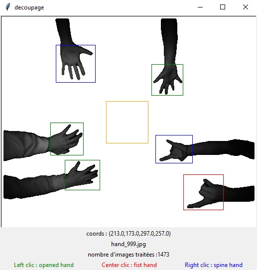

# VOCformatWriter

This tool is designed to create your own datasets using python 3.5

# Functions

 - save positions in a csv file : file,x1,y1,x2,y2,class (one line per object)
 - save positions in a xml file (VOC format : 1 xml = 1 picture)
 - reduce the size of the box if you don't see any usefull data.
 - you can save 3 kinds of objects with 3 differents clics from your mouse. (you can change there name or add/remove items)
 - if you stop the tool and retart it, you'll will continue where you stopped.
 - if a part of your frame is out of the picture, the frame will be resized.
 - if you did a mistake, you can remove the last frame.

# How to use it

 - remove .gitkeep files from both folders (Images/Xml).
 - store your pictures in Images.
 - run the script.
 - use mouse's wheel to modify the size of your frame.
 - right/left/center clic on your objets.
 - remove the last frame by using BackSpace.
 - press Enter to save objets in Xml and csv.

# Tools

 - too take a look on your work, you can use Visualisation.py
 
# Examples

# More

Feel free to modify/upgrade this code. Enjoy!!